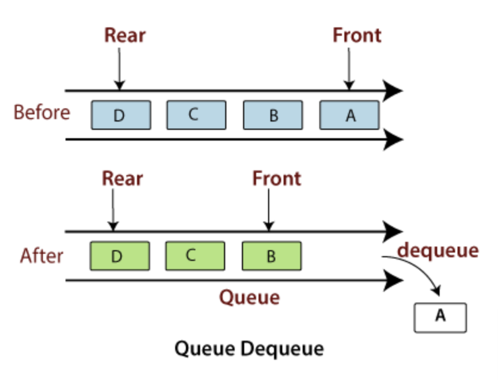

# Queue

Queue is a linear data structure that stores items in First In First Out (FIFO) manner. This means that with a queue, the least recently added item is removed first. A good example of queue is any queue of consumers for a resource where the consumer that came first is served first.


## Enqueue
This is an operation that adds an item to the queue. If the queue is full, then it is said to be an Overflow condition – Time Complexity : O(1)\
Python Code to implement this: my_queue.append(value)


## Dequeue
This operation removes an item from the queue. The items are popped in the same order in which they are pushed or added (FIFO). If the queue is empty, then it is said to be an Underflow condition – Time Complexity : O(1)\
Python Code to implement this: 
value = my_queue[0]\
del my_queue[0]\
or\
value = my_queue.pop(0)




## Queues in Python
Queue is built-in module of Python which is used to implement a queue.
There are various functions available in this module: 
 
- maxsize – Number of items allowed in the queue.
- empty() – Return True if the queue is empty, False otherwise.
- full() – Return True if there are maxsize items in the queue. If the queue was initialized with maxsize=0 (the default), - then full() never returns True.
- get() – Remove and return an item from the queue. If queue is empty, wait until an item is available.
- get_nowait() – Return an item if one is immediately available, else raise QueueEmpty.
- put(item) – Put an item into the queue. If the queue is full, wait until a free slot is available before adding the item.
- put_nowait(item) – Put an item into the queue without blocking. If no free slot is immediately available, raise QueueFull.
- qsize() – Return the number of items in the queue.


## Real-life Queue Scenarios
Examples of queues in "real life":
- A ticket line: The person who comes first gets the ticket first. The person who is coming last is getting the tickets in last. Therefore, it follows first-in-first-out (FIFO) strategy of queue.
- Phone answering system: The person who calls first gets a response first from the phone answering system. The person who calls last gets the response last. Therefore, it follows first-in-first-out (FIFO) strategy of queue.
- A car wash: The vehicle that comes first to the car wash leaves first. The vehicle that comes last leaves last. Therefore, it follows first-in-first-out (FIFO) strategy of queue.


## Example
### Problem
Create a queue with max size = 7 in python and add 'a', 'b', 'c', in that order to the queue. Check to see if it's full and return True or False. Then add '23','19', '6', 'yes' to the queue and check to see if it is full.
```
Output

Is the queue Full?  False

Is the queue Full?  True
```


### Solution
```
from queue import Queue

# Initializing a queue
example_queue = Queue(maxsize = 7)

# Adding of element to queue
example_queue.put('a')
example_queue.put('b')
example_queue.put('c')

# Return Boolean for Full Queue
print("\nIs the queue Full? ", example_queue.full())

# Add 4 more elements to the queue 
example_queue.put(23)
example_queue.put(19)
example_queue.put(6)
example_queue.put('yes')

# Return Boolean for Full Queue
print("\nIs the queue Full? ", example_queue.full())
```


## Problem to Solve
Create a queue with max size = 9 in python. Check to see if the queue is empty. Enqueue '21', '18', '5', '70', '14' in that order. Check to see if it's full. Dequeue twice, print the elements dequeued and then add '2','12', '36', '11' to the queue in that order. Check to see if queue is full.\
\
Expected Output
```
Is the queue Empty?  True

Is the queue Full?  False

Elements dequeued from the queue:
21
18

Is the queue Full?  False
```
When you are done, please compare your code to a possible solution [here](queue_solution.py).
\
\
Click [here](1-welcome.md) to return to Welcome Page\
Click [here](README.md) to return to Outline