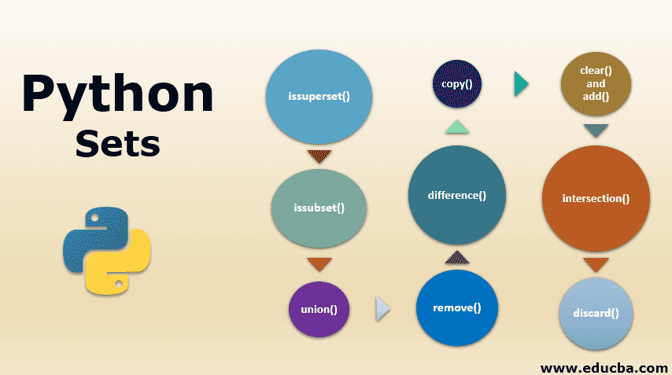

# Sets

Set is one of 4 built-in data types in Python used to store collections of data. The other 3 are List, Tuple, and Dictionary and they all have different qualities and usage. Sets are used to store multiple items in a single variable.
It is important to note that a set is a collection which is both unordered and unindexed. They are also constrained to have no duplicates. Once a set is created, you cannot change its items, but you can add new items.
They are written with curly brackets: '{}'.

\
Image credit: www.educba.com

<br><br>

## Accessing Set Items
We cannot access items in a set by referring to an index or a key.
But we can loop through the set items using a for loop, or ask if a specified value is present in a set, by using the in keyword.

We can create a set by:
- Placing a comma-separated sequence of items in curly braces {}. A set can have a specific data type or mixtures of all. 
  ```
  #A set of strings
  sample_set = {'cap', 'lion', 'indigo'}

  #A set of mixed datatypes
  sample_set = {1, 'abc', 1.23, (3+4j), True}
   ```
- Using a type constructor called set().
  ```
  # Set of items in an iterable
  sample_set = set('yyz')
  print(sample_set)
  # Prints {'y', 'y', 'z'}

  # Set of successive integers
  sample_set = set(range(2, 6))
  print(sample_set)
  # Prints {2, 3, 4, 5}

  # Convert a list into set
  sample_set = set([14, 52, 23])
  print(sample_set)
  # Prints {14, 52, 23}
  ```

We can get the length of a set by using the len function:
```
len(set_name)
```	
The Time Complexity is O(1) - Performance of returning the size of the set
\
Image credit: https://geeksforgeeks.org/


<br><br>


## Adding items in a set
- To add one item to a set use the add() method. The Time Complexity is O(1) - Performance of hashing the value (assuming good conflict resolution)
```
sample_set = {"apple", "banana", "cherry"}

sample_set.add("orange")

print(sample_set)
```
This will give you:
```
{'cherry', 'orange', 'apple', 'banana'}
```

- To add multiple items, use the update() method. The object in the update() method does not have to be a set, it can be any iterable object (tuples, lists, dictionaries etc.).
```
sample_set = {'red', 'green', 'blue'}

sample_set.update(['yellow', 'orange'])

print(sample_set)
```

This will give you:
```
{'blue', 'orange', 'green', 'yellow', 'red'}
```
<br>

## Removing items from a set
To remove an item in a set, use the remove(), or the discard() method. If the item to remove does not exist, remove() will raise an error while discard() will do nothing. The Time Complexity is O(1) - Performance of hashing the value (assuming good conflict resolution)
```
# with remove() method
sample_set = {'yam', 'green', 'red'}
sample.remove('red')
print(sample_set)

# with discard() method
sample_set = {'red', 'cat', 'nail'}
sample_set.discard('red')
print(sample_set)
```

This will print:
```
{'green', 'yam'}

{'nail', 'cat'}
```

<br><br>

## Loop in Sets
We can loop through the set items by using a for loop

### Example
Loop through a set and print the values
```
sample_set = {"Nkem", "Laolu", "Aminu"}

for item in sample_set:
  print(item)
```
This will give us:
```
Aminu
Laolu
Nkem
```


<br><br>

## Joins in Sets
There are mathematical operations like 'intersection' and 'union' used to perform joins between two sets. Look at the example below:
The union() method that will return a new set containing all items from both sets without duplicates.
The intersection() method will return a new set, that only contains the items that are present in both sets.
```
seta = {1, 1, 2, 3, 4, 5}
setb = {4, 4, 5, 6, 7, 8}

y = seta.intersection(setb)  # This will result in {4, 5}

z = seta.union(setb)  # This will result in {1, 2, 3, 4, 5, 6, 7, 8}

print(y)
print(z)
```

<br>

## Set Methods and Operations
 Method                         | Description                                                                      |
--------------------------------|----------------------------------------------------------------------------------|
| add()                         | Adds an element to the set                                                       |
| clear()                       | Removes all the elements from the set                                            |
| copy()                        | Returns a copy of the set                                                        |
| difference()                  | Returns a set containing the difference between two or more sets                 |
| difference_update()           | Removes the items in this set that are also included in another, specified set   |
| discard()                     | Remove the specified item                                                        |
| intersection()                | Returns a set, that is the intersection of two other sets                        |
| intersection_update()         | Removes the items in this set that are not present in other, specified set(s)    |
| isdisjoint()                  | Returns whether two sets have a intersection or not                              |
| issubset()                    | Returns whether another set contains this set or not                             |
| issuperset()                  | Returns whether this set contains another set or not                             |
| pop()                         | Removes an element from the set                                                  |
| remove()                      | Removes the specified element                                                    |
| symmetric_difference()        | Returns a set with the symmetric differences of two sets                         |
| symmetric_difference_update() | Inserts the symmetric differences from this set and another                      |
| union()                       | Return a set containing the union of sets without duplicates                     |
| update()                      | Update the set with the union of this set and others                             |
source: [w3schools.com](https://www.w3schools.com/python/python_sets_methods.asp)

<br><br><br>

## Example
### Problem
There are two sets respectively {1, 2, 3, 4, 5} and {4, 5, 6, 7, 8}. Remove the intersection of both sets and print out both sets.
Output
```
Remove the intersection of a 2nd set from the 1st set using difference_update():
sn1:  {1, 2, 3}
sn2:  {4, 5, 6, 7, 8}
```
Solution Code
```
sn1 = {1,2,3,4,5}
sn2 = {4,5,6,7,8}

print("\nRemove the intersection of a 2nd set from the 1st set using difference_update():")

sn1.difference_update(sn2)

print("sn1: ",sn1)
print("sn2: ",sn2)
```

<br><br>

## Problem to Solve
Given a string, count the number of vowels present in given string using Sets.
<br>
For Example:
```
Input : Onome
Output : No. of vowels : 3

Input : Hello World Yes I am exhausted
Output : No. of vowels :  10
```

<br>

Test cases for Problem
```
vowel_count('Ozioma is a big boy')
vowel_count('12456890-')
vowel_count('-? very well -. OKAY YES SIR')
```

Expected Output based on test cases above:
```
No. of vowels : 8
No. of vowels : 0
No. of vowels : 6
```

When you are done, please compare your code to a possible solution [here](sets_solution.py).
\
\
Click [here](1-welcome.md) to return to Welcome Page\
Click [here](README.md) to return to Outline