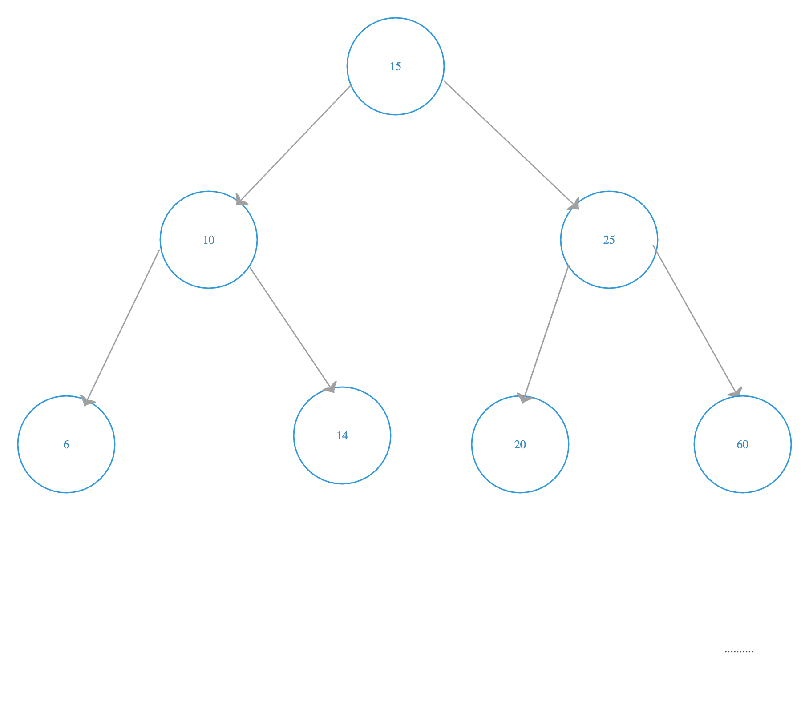

# Trees

A tree is composed of several nodes that are linked together by links called edges. A tree has 3 main properties which are the following:

- The main node is named as the root node which is the top of the tree.
- Each node other than the root is associated with a parent node.
- Each node can have a child node arbitrary number.

Note: Nodes that have no child nodes (with a reference to null for these children) are called leaves.

\
Image credit: [educative](https://www.educative.io/edpresso/binary-trees-in-python)

<br><br>

## Binary Tree
A binary tree is a tree whose elements have at most two children. Each element in a binary tree can have only two children. There is no particular order for these nodes. A Binary Tree is an ordered, rooted tree. Since each element in a binary tree can have only 2 children, we typically name them the left and right child. Every node below has a node above known as the parent node.

\
Image credit: https://andrew.cmu.edu/


<br><br>


## Binary Search Tree
For a Binary Search Tree, there will be at most two child nodes — left and right, that are arranged in a particular order. The left child of a parent node will always have a smaller value compared to the parent node. This means that a node’s left child must have a value less than its parent’s value, and the node’s right child must have a value greater than its parent value. These conditions are true for the subtree of the child nodes as well. These properties will make search operations faster when the data is organized into a Binary Search Tree.

\
Image credit: [Harish Reddy Konduru](https://medium.com/@konduruharish/binary-search-tree-in-typescript-and-c-25fa5107cc5d)

<br>

The greater-than and less-than ordering of nodes mean that each comparison skips about half of the remaining tree, so the whole lookup takes time proportional to the number of nodes in the tree. binary search trees provide an average Big-O complexity of O(log(n)) for retrieval, insertion, update, and delete operations.


<br><br>


## Inserting and Searching a Binary Search Tree (BST)

To get started, we have to implement a constructor which will use a Node class. 
```
class BSTNode:
    def __init__(self, data=None):
        self.left = None
        self.right = None
        self.data = data
```
<br>

Inserting into a BST<br>
While inserting a node in a binary search tree, three conditions may arise.

- The Binary search tree can be empty. i.e. Root itself will be a value None.
- The Value to be inserted is less than the root.
- The value to be inserted is greater than the root.<br>
  
If the value of the new data is less than the value of the current node, we will add it to the left child of the binary search tree, otherwise, we will add it to the right child.
```
    def _insert(self, data, node):
        """
        This function will look for a place to insert a node
        with 'data' inside of it.  The current sub-tree is
        represented by 'node'.  This function is intended to be
        called the first time by the insert function.
        """
        if data < node.data:
            # The data belongs on the left side.
            if node.left is None:
                # We found an empty spot
                node.left = BST.Node(data)
            else:
                # Need to keep looking.  Call _insert
                # recursively on the left sub-tree.
                self._insert(data, node.left)
        elif data > node.data:
            # The data belongs on the right side.
            if node.right is None:
                # We found an empty spot
                node.right = BST.Node(data)
            else:
                # Need to keep looking.  Call _insert
                # recursively on the right sub-tree.
                self._insert(data, node.right)
```
<br>

Searching a BST
```
    def _contains(self, data, node):
        """
        This funciton will search for a node that contains
        'data'.  The current sub-tree being search is 
        represented by 'node'.  This function is intended
        to be called the first time by the __contains__ function.
        """
        if node is None:
            return False
        else:
            if data == node.data:
                return True
            elif data < node.data:
                return self._contains(data, node.left)
            else:
                return self._contains(data, node.right)
```

<br>

## Binary Search Tree Common Functions
 Method                         | Description                                                                      |
--------------------------------|----------------------------------------------------------------------------------|
| insert(the_value)             | This inserts a value into the tree. The performance is O(log n)                  |
| remove(the_value)             | This removes a value from the tree. The performance is O(log n)                  |
| contains(the_value)           | This determines if a value is in the tree. The performance is O(log n)           |
| traverse_forward              | This visits all objects from small to large. The performance is O(log n)         |
| traverse_reverse              | This visits all objects from large to small. The performance is O(log n)         |
| height(node)                  | This determines the height of the node. The performance is O(log n)              |

source: [Here](https://byui-cse.github.io/cse212-course/lesson09/09-prepare.html)

<br><br><br>

## Example

Write a Python program to check whether a given a binary tree is a valid binary search tree (BST) or not.<br>
Source: [Here](https://www.w3resource.com/python-exercises/data-structures-and-algorithms/python-binary-search-tree-exercise-3.php)
```
Example 1
      7
    /   \
  6       8

Binary tree [7,6,8]. It should return True.

Example 2
      6
    /   \
  7       8

Binary tree [6,7,8]. It should return False.
```

Python Solution Code
```
class TreeNode(object):
    def __init__(self, x):
        self.val = x
        self.left = None
        self.right = None

def is_BST(root):
    stack = []
    prev = None
    
    while root or stack:
        while root:
            stack.append(root)
            root = root.left
        root = stack.pop()
        if prev and root.val <= prev.val:
            return False
        prev = root
        root = root.right
    return True

root = TreeNode(2)  
root.left = TreeNode(1)  
root.right = TreeNode(3) 
 
result = is_BST(root)
print(result)

root = TreeNode(1)  
root.left = TreeNode(2)  
root.right = TreeNode(3) 
 
result = is_BST(root)
print(result)
```

Example Output
```
True
False
```


<br><br>

## Problem to Solve
Create a binary search tree and insert data like the image below. Then print the node with corresponding left and right nodes if any. 


<br>
<br>

Test cases for Problem
```
root= insert(None,15)
insert(root,10)
insert(root,25)
insert(root,6)
insert(root,14)
insert(root,20)
insert(root,60)
```

Expected Output based on test cases above:
```
Root Node is: 15
left child of node is: 10
right child of node is: 25

Node is: 10
left child of node is: 6
right child of node is: 14

Node is: 25
left child of node is: 20
right child of node is: 60

Node is: 6
left child of node is: None
right child of node is: None

Node is: 14
left child of node is: None
right child of node is: None

Node is: 20
left child of node is: None
right child of node is: None

Node is: 60
left child of node is: None
right child of node is: None
```

When you are done, please compare your code to a possible solution [here](trees_solution.py).
\
\
Click [here](1-welcome.md) to return to Welcome Page\
Click [here](README.md) to return to Outline